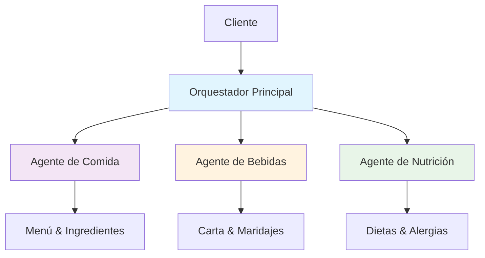

# 🍽️ Restaurant Multi-Agent System

[](https://opensource.org/licenses/Apache-2.0)
[](https://www.python.org/downloads/)
[](https://github.com/google/adk-python)
[](https://github.com/psf/black)

> 🤖 **Sistema multiagente sofisticado para restaurantes basado en Agent Development Kit (ADK) de Google**

Un sistema code-first que utiliza múltiples agentes especializados para proporcionar una experiencia de atención al cliente excepcional en restaurantes, manejando consultas sobre comida, bebidas y nutrición de manera inteligente y coordinada.

## ✨ Características Principales

- 🎯 **Agentes Especializados**: Especialistas en comida, bebidas y nutrición
- 🧠 **Routing Inteligente**: Deriva consultas automáticamente al agente apropiado
- 🌍 **Soporte Multiidioma**: Español e inglés con detección automática
- 🔄 **Comunicación A2A**: Protocolo Agent-to-Agent para coordinación
- 📊 **Evaluación Integrada**: Sistema de evaluación y métricas de calidad
- 🚀 **Deployment Flexible**: Compatible con Cloud Run, Vertex AI y local
- 🛡️ **Seguridad Alimentaria**: Manejo especial de alergias e intolerancias

## 🏗️ Arquitectura



## 🚀 Instalación Rápida

### Pre-requisitos

- Python 3.9+
- Cuenta de Google AI Studio o Google Cloud
- Git

### Instalación

```bash
# Clonar el repositorio
git clone https://github.com/restaurant-ai/multiagent-system.git
cd multiagent-system/restaurant_system

# Crear entorno virtual
python -m venv restaurant_env
source restaurant_env/bin/activate  # Linux/Mac
# o
restaurant_env\Scripts\activate     # Windows

# Instalar dependencias
pip install -e .
# o para desarrollo
pip install -e ".[dev]"
```

### Configuración

```bash
# Copiar archivo de configuración
cp env_example.txt .env

# Editar .env y agregar tu API key
GOOGLE_API_KEY=tu_google_ai_api_key_aqui
```

## 💡 Uso Básico

### Modo Interactivo

```bash
python main.py
```

### Uso Programático

```python
from restaurant_system import RestaurantMultiAgentSystem

# Inicializar sistema
system = RestaurantMultiAgentSystem()

# Procesar consulta
response = await system.process_query(
    "¿Tienen opciones sin gluten en el menú?",
    user_id="customer_123"
)

print(response)
```

### API REST

```bash
# Iniciar servidor
uvicorn restaurant_system.api:app --reload

# Consulta via API
curl -X POST "http://localhost:8000/query" \
  -H "Content-Type: application/json" \
  -d '{"query": "¿Qué vinos recomiendan con el salmón?", "user_id": "customer_123"}'
```

## 🎯 Ejemplos de Consultas

| Tipo | Ejemplo | Agente Especializado |
|------|---------|---------------------|
| **Comida** | "¿Qué ingredientes tiene la paella?" | 🍽️ FoodSpecialist |
| **Bebidas** | "¿Qué vino marida con el salmón?" | 🍷 DrinksSpecialist |
| **Nutrición** | "¿Tienen opciones veganas?" | 🥗 NutritionSpecialist |
| **Mixta** | "Menú completo sin gluten con maridaje" | 🤝 Coordinación Multi-Agente |

## 🧪 Testing y Evaluación

### Tests Unitarios

```bash
# Ejecutar tests
pytest

# Con coverage
pytest --cov=restaurant_system --cov-report=html

# Solo tests rápidos
pytest -m "not slow"
```

### Evaluación de Agentes

```bash
# Evaluar sistema completo
adk eval . tests/evaluation/restaurant_eval_set.json

# Evaluar agente específico
adk eval agents/food_agent tests/evaluation/food_agent_eval.json
```

### Desarrollo

```bash
# Formatear código
black restaurant_system/
isort restaurant_system/

# Linting
flake8 restaurant_system/
mypy restaurant_system/

# Pre-commit hooks
pre-commit install
pre-commit run --all-files
```

## 📊 Deployment

### Local (Desarrollo)

```bash
python main.py
```

### Cloud Run

```bash
# Build y deploy
gcloud run deploy restaurant-system \
  --source . \
  --platform managed \
  --region us-central1 \
  --allow-unauthenticated
```

### Vertex AI Agent Engine

```bash
# Configurar para Vertex AI
adk deploy vertex-ai \
  --project-id tu-proyecto \
  --location us-central1 \
  --agent-config config/vertex_ai_config.yaml
```

## 📁 Estructura del Proyecto

```
restaurant_system/
├── agents/                 # Agentes especializados
│   ├── orchestrator_agent.py
│   ├── food_agent.py
│   ├── drinks_agent.py
│   └── nutrition_agent.py
├── config/                 # Configuraciones
│   ├── system_config.py
│   └── deployment_config.py
├── tests/                  # Tests y evaluaciones
│   ├── unit/
│   ├── integration/
│   └── evaluation/
├── tools/                  # Herramientas personalizadas
├── api/                    # API REST
├── scripts/                # Scripts de utilidad
├── main.py                 # Punto de entrada principal
├── pyproject.toml          # Configuración del proyecto
└── README.md
```

## 🛠️ Configuración Avanzada

### Variables de Entorno

```bash
# Google AI Configuration
GOOGLE_API_KEY=tu_api_key
GOOGLE_GENAI_USE_VERTEXAI=FALSE

# Sistema
RESTAURANT_NAME="Mi Restaurante Gourmet"
DEFAULT_LANGUAGE=es
DEBUG_MODE=true

# Performance
SESSION_TIMEOUT=3600
MAX_CONCURRENT_SESSIONS=100
AGENT_TIMEOUT=30
```

### Personalización de Agentes

```python
# Personalizar especialista en comida
from restaurant_system.agents import FoodSpecialistAgent

food_agent = FoodSpecialistAgent(
    model="gemini-2.0-flash-exp",
    temperature=0.7,
    custom_instructions="Especialista en cocina mediterránea...",
    tools=["menu_search", "allergen_check", "nutrition_info"]
)
```

## 📈 Monitoring y Observabilidad

### Métricas Integradas

- 📊 **Tiempo de respuesta** por agente
- 🎯 **Precisión de routing** automático
- 💬 **Satisfacción del cliente** via feedback
- 🔄 **Tasa de colaboración** entre agentes

### Logging

```python
import logging
from restaurant_system.logging import setup_logging

# Configurar logging avanzado
setup_logging(
    level=logging.INFO,
    format="json",
    output="logs/restaurant_system.log"
)
```

## 🤝 Contribuir

¡Las contribuciones son bienvenidas! Por favor lee nuestra [guía de contribución](CONTRIBUTING.md).

1. Fork el proyecto
2. Crea una rama para tu feature (`git checkout -b feature/amazing-feature`)
3. Commit tus cambios (`git commit -m 'Add amazing feature'`)
4. Push a la rama (`git push origin feature/amazing-feature`)
5. Abre un Pull Request

## 📄 Licencia

Este proyecto está licenciado bajo la Licencia Apache 2.0 - ver el archivo [LICENSE](LICENSE) para detalles.

## 🙏 Agradecimientos

- [Agent Development Kit (ADK)](https://github.com/google/adk-python) de Google
- [Gemini](https://ai.google.dev/) para los modelos de lenguaje
- Comunidad open source de ADK

## 📞 Soporte

- 📖 [Documentación completa](https://restaurant-ai.github.io/multiagent-system/)
- 🐛 [Reportar bugs](https://github.com/restaurant-ai/multiagent-system/issues)
- 💬 [Discusiones](https://github.com/restaurant-ai/multiagent-system/discussions)
- 📧 Email: support@restaurant-ai.com

---

**¡Construido con ❤️ usando Agent Development Kit!** 